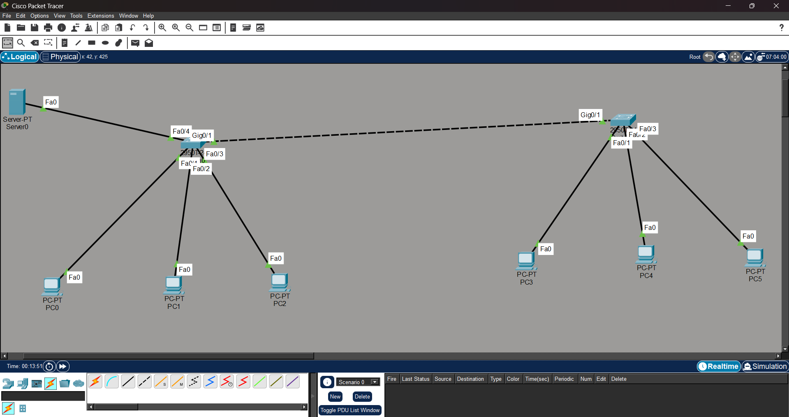
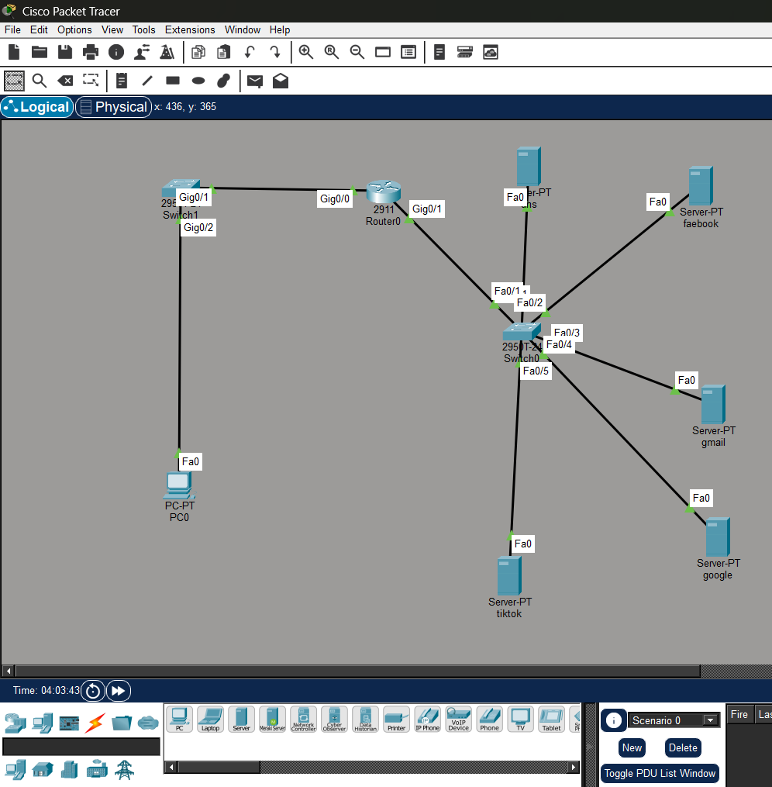

# Computer Networks Laboratory  
## Lab No. 4: DHCP with VLAN and Network Address Translation (NAT)

---

## Objectives

1. To configure **DHCP** for automatic IP address assignment in a network.
2. To implement **DHCP with VLAN** and understand its working along with **NAT**.

---

## Theory

### Dynamic Host Configuration Protocol (DHCP)

DHCP is a network protocol that automatically assigns IP addresses and other network parameters such as subnet mask and default gateway to network devices. It avoids manual IP configuration and reduces configuration errors. DHCP works on a client-server model where the DHCP server responds to client requests for IP addresses.

---

### Virtual Local Area Network (VLAN)

VLAN is a logical grouping of devices within a network. It allows devices to be separated into different broadcast domains even when they are connected to the same physical switch. VLANs improve network security, reduce broadcast traffic, and make network management easier.

---

### Network Address Translation (NAT)

NAT is used to convert private IP addresses into a public IP address when devices communicate with external networks. It helps conserve public IP addresses and provides basic security by hiding internal IP addresses from outside networks.

---

### Relationship Between DHCP, VLAN, and NAT

In a VLAN-based network, DHCP assigns IP addresses according to VLAN membership. NAT then allows devices from different VLANs using private IP addresses to access external networks through a single public IP address.

---

## Lab Works

---

### Part A: DHCP Configuration

In this part, DHCP is configured to automatically assign IP addresses to devices in a single network.


#### Network Configuration Figure



*Fig 1: DHCP Configuration Network*

---

### Part B: DHCP with VLAN Configuration

In this part, multiple VLANs are created and DHCP is configured to assign IP addresses for each VLAN separately.


### VLAN Configuration

```bash
Switch>enable
Switch#vlan database

Switch(vlan)#vlan 10 name admin
VLAN 10 added:
    Name: admin

Switch(vlan)#vlan 20 name account
VLAN 20 added:
    Name: account

Switch(vlan)#vlan 30 name exam
VLAN 30 added:
    Name: exam

Switch(vlan)#exit
APPLY completed.
Exiting....

Switch#conf t
Enter configuration commands, one per line.  End with CNTL/Z.

Switch(config)#interface gig 0/1
Switch(config-if)#switchport mode trunk

%LINEPROTO-5-UPDOWN: Line protocol on Interface GigabitEthernet0/1, changed state to down
%LINEPROTO-5-UPDOWN: Line protocol on Interface GigabitEthernet0/1, changed state to up

Switch(config-if)#inte fa0/1
Switch(config-if)#switchport mode access
Switch(config-if)#switchport access vlan 10

Switch(config-if)#inte range fa0/2-4
Switch(config-if-range)#switchport mode access
Switch(config-if-range)#switchport access vlan 20

Switch(config-if-range)#inte fa0/20
Switch(config-if)#switchport mode access
Switch(config-if)#switchport access vlan 30
```

#### Network Configuration Figure


*Fig 2: DHCP with VLAN and NAT Configuration*

---

### Part C: DNS Server Configuration

In this part, a **DNS server** is configured to translate **domain names into IP addresses**, allowing devices to access network resources using easy-to-remember names instead of numeric IP addresses.

#### Steps Overview

- Configure a DNS server with a domain name.
- Add DNS records that map domain names to IP addresses.
- Configure client devices to use the DNS server.
- Test DNS resolution using simple network commands.

#### DNS Network Configuration Figure



*Fig 3: DNS Server Configuration*

---

#### Verification

- Client devices were configured to use the DNS server IP.
- Domain names were successfully resolved to their respective IP addresses.
- Connectivity was verified by accessing resources using domain names.
- Successful resolution confirmed correct DNS server operation.


## Discussion and Conclusion

This lab demonstrated the working of DHCP in both single-network and VLAN-based environments. DHCP simplified IP address management, VLANs improved network segmentation, and NAT enabled external communication using private IP addresses. Overall, the lab provided a clear understanding of modern network configuration techniques.

---

## Result

DHCP and DHCP with VLAN configurations were implemented successfully, and network connectivity was verified using ping tests.
