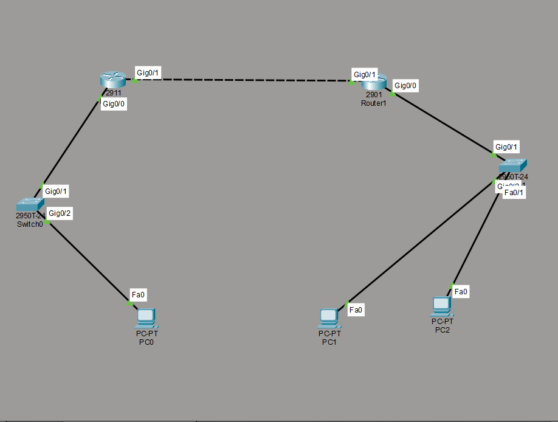
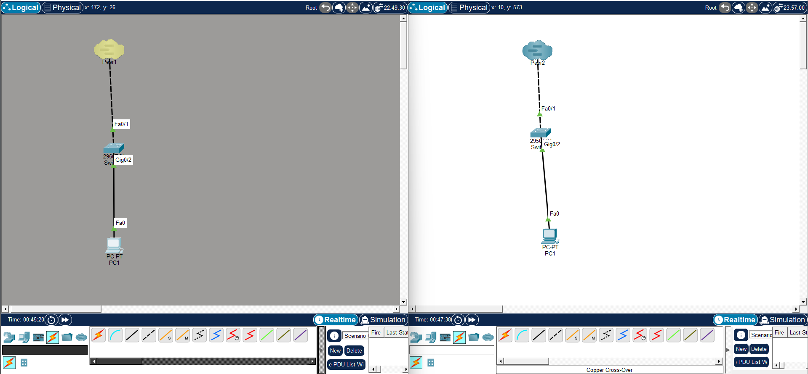

# Computer Networks Lab – 6  
## Title: Access Control List (ACL) Commands

---

## Objective

- To understand the concept of **Access Control Lists (ACLs)** 
 - To implement **standard and extended ACL commands** in a network device (router) to control network traffic based on defined rules.

---

## Theory

An **Access Control List (ACL)** is a set of rules used to **permit or deny network traffic** based on certain conditions such as source IP address, destination IP address, protocol type, and port number.

ACLs are commonly used in routers and firewalls to improve **network security**, **traffic management**, and **access restriction**.

### Types of ACLs

#### 1. Standard ACL
- Filters traffic based **only on source IP address**
- Number range:
  - **1–99**
  - **1300–1999**
- Usually placed **near the destination**

#### 2. Extended ACL
- Filters traffic based on:
  - Source IP
  - Destination IP
  - Protocol (TCP, UDP, ICMP)
  - Port number
- Number range:
  - **100–199**
  - **2000–2699**
- Usually placed **near the source**

### ACL Operation Rules
- ACLs are processed **top to bottom**
- First matching rule is applied
- There is an **implicit deny** at the end of every ACL

---

## Code

### A. Standard ACL Example

**Scenario:**  
Deny traffic from network `192.168.1.0/24` and allow all other traffic.

```bash
Router> enable
Router# configure terminal
Router(config)# access-list 10 deny 192.168.3.3
Router(config)# access-list 10 permit any
Router(config)# interface gigabitEthernet 0/0
Router(config-if)# ip access-group 1 out
Router(config-if)# exit
Router(config)# exit
```
#### Configuration Figure



---
### Multi user Environment
## Steps

```
Left Side Multiuser

​Click Extension \rightarrow Select listening port

​Extension \rightarrow Multiuser \rightarrow Port visibility option and select Network check box — OK

​Click on Multiuser icon of the drawing and select outgoing option from list.

​Click on Peer Network Name and type Peer 2 on textbox.
​Type password as required then click on connect.

​If all settings are OK on both screens, then message appears as below then click on Yes button.


​Right Side Multiuser
​Click on Multiuser icon of the drawing and select incoming option from list.

```

#### Configuration Figure



---
### Discussion & Conclusion

In this lab, Access Control List (ACL) commands were configured on a router to control and secure network traffic in a multiuser environment. By implementing a standard ACL, access was selectively denied to specific users based on their IP addresses while allowing other users to communicate normally, demonstrating effective traffic management. The experiment emphasized the importance of correct command syntax, proper configuration modes, and suitable ACL placement on router interfaces. Overall, the lab successfully showed how ACLs enhance network security and provide controlled access in shared networks by filtering traffic according to defined rules.